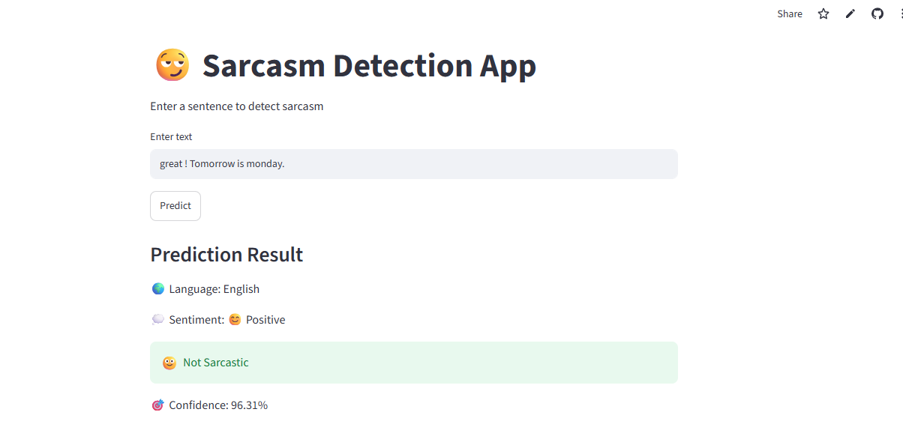

<div align="center">

# 😏 Sentify
### Multilingual Sarcasm Detection Dashboard

[](https://python.org)
[](https://flask.palletsprojects.com)
[](https://tensorflow.org)
[](https://huggingface.co/spaces/Kaweri05/sentify)
[](https://github.com/Kaweri05/sarcasm-detection)
[](LICENSE)

**Detect sarcasm, analyze sentiment, and translate text across 22+ languages — on any device.**

🔗 **Live Demo:** [huggingface.co/spaces/Kaweri05/sentify](https://huggingface.co/spaces/Kaweri05/sentify)
📁 **GitHub:** [github.com/Kaweri05/sarcasm-detection](https://github.com/Kaweri05/sarcasm-detection)



</div>

---

## 📌 Project Overview

**Sentify** is a full-stack AI-powered web application that detects sarcasm in text using a deep learning LSTM model. It supports multiple languages including English, Hindi, Marathi, and Hinglish, with real-time translation across 22+ languages, sentiment analysis, voice input, and an analytics dashboard — all accessible on mobile and desktop.

---

## 🗺️ Block Diagrams

### 1️⃣ System Architecture

```
┌─────────────────────────────────────────────────────────────┐
│                        SENTIFY SYSTEM                        │
├─────────────────┬───────────────────┬───────────────────────┤
│   FRONTEND      │     BACKEND       │      DATA LAYER       │
│   (Browser)     │     (Flask)       │                       │
│                 │                   │                       │
│  HTML/CSS/JS ──►│  server.py        │  sarcasm.json         │
│  Plotly Charts  │  ├── /predict     │  (26,000+ headlines)  │
│  Web Speech API │  ├── /history     │                       │
│  MyMemory API   │  └── /            │  analysis_history.json│
│                 │                   │  (prediction logs)    │
│  Mobile UI      │  TensorFlow LSTM  │                       │
│  Bottom Nav     │  TextBlob NLP     │  model_metrics.json   │
│  Responsive     │  Word-list Lang   │  (accuracy score)     │
└─────────────────┴───────────────────┴───────────────────────┘
```

---

### 2️⃣ ML Model Pipeline

```
  Raw Text Input
       │
       ▼
┌─────────────┐
│  Tokenizer  │  ← vocab_size=10,000 · oov_token="<OOV>"
└──────┬──────┘
       │
       ▼
┌─────────────┐
│   Padding   │  ← maxlen=40 · post-padding
└──────┬──────┘
       │
       ▼
┌─────────────────┐
│ Embedding Layer │  ← 10,000 vocab → 64-dim dense vectors
└────────┬────────┘
         │
         ▼
┌─────────────────┐
│  LSTM (64 units)│  ← captures long-range sequence context
└────────┬────────┘
         │
         ▼
┌─────────────────┐
│ Dense · ReLU 24 │  ← feature extraction
└────────┬────────┘
         │
         ▼
┌──────────────────┐
│ Dense · Sigmoid 1│  ← binary output: 0=not sarcastic, 1=sarcastic
└────────┬─────────┘
         │
         ▼
  Confidence Score (0–100%)
```

---

### 3️⃣ Prediction Request Flow

```
  Browser                    Flask (server.py)              Storage
    │                               │                          │
    │── POST /predict ─────────────►│                          │
    │   { "text": "..." }           │                          │
    │                               │── detect_language()      │
    │                               │── analyse_sentiment()    │
    │                               │── predict_sarcasm()      │
    │                               │                          │
    │                               │── append_history() ─────►│
    │                               │                  analysis_history.json
    │◄── JSON Response ─────────────│                          │
    │  {                            │                          │
    │    language,                  │                          │
    │    sentiment,                 │                          │
    │    sarcasm: true/false,       │                          │
    │    confidence: 75.0,          │                          │
    │    trendAlert: false,         │                          │
    │    plotData: {...}            │                          │
    │  }                            │                          │
    │                               │                          │
    │── Render result + chart       │                          │
    │── Trigger alert if conf>80%   │                          │
```

---

### 4️⃣ Translation Flow

```
  User Types / Speaks Text
           │
           ▼
  ┌─────────────────┐
  │  Source Language│  ← Auto-detect or manual select
  │  Selector       │     (22 languages supported)
  └────────┬────────┘
           │
           ▼
  ┌─────────────────────────────┐
  │  MyMemory Free API          │
  │  api.mymemory.translated.net│
  │  GET ?q={text}&langpair=    │
  │      {src}|{tgt}            │
  └────────┬────────────────────┘
           │
           ▼
  ┌─────────────────┐
  │ Translated Text │
  │ displayed in    │
  │ output box      │
  └────────┬────────┘
           │
     ┌─────┴──────┐
     ▼            ▼
  Copy Text    Analyze for
  to clipboard   Sarcasm
                   │
                   ▼
            POST /predict
            (with translated text)
```

---

### 5️⃣ Language & Sentiment Analytics Flow

```
  analysis_history.json (all saved predictions)
              │
              ▼
  ┌───────────────────────┐
  │   Parse History Data  │
  └──────────┬────────────┘
             │
    ┌────────┼────────┐
    ▼        ▼        ▼
┌────────┐ ┌──────┐ ┌──────────┐
│Language│ │Senti-│ │ Sarcasm  │
│ Mix    │ │ment  │ │  Rate    │
│ Page   │ │ Page │ │ Stats    │
└───┬────┘ └──┬───┘ └────┬─────┘
    │         │           │
    ▼         ▼           ▼
 Donut     Pie Chart   Bar Chart
 Chart +   Pos/Neg/Neu  by Language
 Bar Chart  × Sarcasm
```

---

### 6️⃣ Alert System Flow

```
  Prediction Result
         │
         ▼
  ┌─────────────────────────┐
  │  Is sarcasm == true?    │
  └────────┬────────────────┘
           │
      YES  │   NO
       ┌───┘    └──► No alert
       ▼
  ┌─────────────────────────┐
  │  confidence >= threshold│  ← default 80% (configurable)
  │  (from Settings page)   │
  └────────┬────────────────┘
           │
      YES  │   NO
       ┌───┘    └──► No alert
       ▼
  ┌─────────────────────────┐
  │  triggerAlert()         │
  │  ├── Show red banner    │
  │  ├── Increment badge    │
  │  └── Log to Alerts page │
  └─────────────────────────┘
```

---

## 📱 App Instructions (User Flowchart)

```
                    ┌──────────────┐
                    │  Open Sentify│
                    │  in Browser  │
                    └──────┬───────┘
                           │
                           ▼
                    ┌──────────────┐
                    │  Dashboard   │◄──────────────────┐
                    │  Home Page   │                   │
                    └──────┬───────┘                   │
                           │                           │
           ┌───────────────┼────────────────┐          │
           ▼               ▼                ▼          │
    ┌─────────────┐ ┌────────────┐  ┌─────────────┐   │
    │ Type text   │ │ Tap 🎙️ Mic│  │ Tap 🌐      │   │
    │ in box      │ │ and Speak  │  │ Translator  │   │
    └──────┬──────┘ └─────┬──────┘  └──────┬──────┘   │
           │              │                │           │
           └──────┬───────┘                │           │
                  ▼                        ▼           │
           ┌─────────────┐         ┌─────────────┐    │
           │ Click       │         │ Select      │    │
           │ "Predict"   │         │ Languages   │    │
           └──────┬──────┘         │ Click Trans-│    │
                  │                │ late        │    │
                  ▼                └──────┬──────┘    │
           ┌─────────────┐                │           │
           │ View Result │                ▼           │
           │ • Language  │         ┌─────────────┐    │
           │ • Sentiment │         │ View Trans- │    │
           │ • Sarcastic?│         │ lation      │    │
           │ • Confidence│         │             │    │
           └──────┬──────┘         │ Click       │    │
                  │                │ "Analyze    │    │
           ┌──────┴──────┐         │ for Sarcasm"│    │
           │             │         └──────┬──────┘    │
           ▼             ▼                │           │
    ┌────────────┐ ┌──────────┐           └───────────┤
    │ Confidence │ │ Click 🔊 │                       │
    │  > 80%?    │ │ Speak    │                       │
    └─────┬──────┘ │ Result   │                       │
          │        └──────────┘                       │
    YES   │   NO                                      │
     ┌────┘   └──► Continue                           │
     ▼                                                │
    ┌────────────┐                                    │
    │ 🚨 Alert  │                                    │
    │ Banner     │                                    │
    │ appears   │                                    │
    └─────┬──────┘                                   │
          │                                          │
          ▼                                          │
    ┌────────────┐    ┌──────────┐  ┌─────────────┐  │
    │ View       │    │ View     │  │ View        │  │
    │ Alerts     │    │ History  │  │ Language Mix│  │
    │ Page 🚨    │    │ Page 🕓  │  │ Sentiment 💭│  │
    └────────────┘    └──────────┘  └──────┬──────┘  │
                                           │         │
                                           └─────────┘
```

---

## 🚀 Features

| Feature | Description |
|---|---|
| 😏 Sarcasm Detection | LSTM model trained on 26,000+ headlines |
| 🌍 Multilingual | English, Hindi, Marathi, Hinglish |
| 🌐 Translator | 22+ languages via MyMemory API |
| 🎙️ Voice Input | Speech-to-text via Web Speech API |
| 🔊 Text-to-Speech | Reads results aloud |
| 📊 Analytics | Language mix, sentiment, confidence charts |
| 🚨 Alerts | Auto-trigger on high-confidence sarcasm |
| 📱 Mobile-first | Bottom nav, hamburger menu, responsive |
| 📥 Export CSV | Download full prediction history |
| 👤 Profile | Customizable user profile with badges |
| 🌐 i18n UI | Interface in English, Hindi, Marathi, Spanish, French |

---

## 🛠️ Tech Stack

| Layer | Technology |
|---|---|
| Language | Python 3.10 |
| Backend | Flask 3.1.3 |
| ML Model | TensorFlow-CPU 2.15.0 / Keras LSTM |
| NLP | NLTK, TextBlob |
| Translation | MyMemory Free API |
| Frontend | HTML5, CSS3, Vanilla JavaScript |
| Charts | Plotly.js |
| Speech | Web Speech API (browser-native) |
| Dataset | Sarcasm Headlines Dataset (Kaggle) |
| Deployment | Hugging Face Spaces (Docker) |

---

## 📂 Project Structure

```
sarcasm-detection/
├── server.py                 ← Flask backend (main entry point)
├── app.py                    ← Legacy Streamlit version
├── requirements.txt          ← Python dependencies
├── Dockerfile                ← Hugging Face deployment
├── Procfile                  ← Render/Railway deployment
├── runtime.txt               ← Python 3.10 version pin
├── sarcasm.json              ← Dataset (26,000+ headlines)
├── templates/
│   └── index.html            ← Full dashboard UI
├── static/
│   └── style.css             ← Mobile-first styles
└── backend/
    ├── model_metrics.json    ← Model accuracy
    └── analysis_history.json ← Prediction history log
```

---

## ⚙️ Run Locally

```bash
# 1. Clone
git clone https://github.com/Kaweri05/sarcasm-detection.git
cd sarcasm-detection

# 2. Install dependencies
pip install -r requirements.txt

# 3. Create backend folder
mkdir -p backend
echo '{"accuracy": 78.34}' > backend/model_metrics.json
echo '[]' > backend/analysis_history.json

# 4. Run
python server.py

# 5. Open browser
# http://localhost:5000
```

---

## 🌐 Deployment

| Platform | Status | URL |
|---|---|---|
| Hugging Face Spaces | ✅ Live | [huggingface.co/spaces/Kaweri05/sentify](https://huggingface.co/spaces/Kaweri05/sentify) |
| GitHub | ✅ Source | [github.com/Kaweri05/sarcasm-detection](https://github.com/Kaweri05/sarcasm-detection) |
| Kaggle | ✅ Notebook | [kaggle.com/Kaweri05](https://kaggle.com/Kaweri05) |

---

## 🌍 Supported Languages

| Language | Detection | Translation | TTS |
|---|---|---|---|
| English | ✅ | ✅ | ✅ |
| Hindi | ✅ | ✅ | ✅ |
| Marathi | ✅ | ✅ | ✅ |
| Spanish | — | ✅ | ✅ |
| French | — | ✅ | ✅ |
| Arabic | — | ✅ | ✅ |
| Japanese | — | ✅ | ✅ |
| + 15 more | — | ✅ | — |

---

## 🔮 Future Enhancements

- 🤖 BERT / IndicBERT for improved accuracy
- 🎙️ Voice-based sarcasm detection
- 😂 Meme sarcasm detection
- 🐦 Twitter / WhatsApp integration
- 📊 Batch CSV analysis
- 🌏 Full Indic language NLP support

---

## 👩‍💻 Author

**Kaweri Harinkhede**
Computer Engineering Student · AI & NLP Enthusiast

[](https://github.com/Kaweri05)

---

## ⭐ Conclusion

Sentify bridges the gap between traditional English-only sarcasm detection and real-world multilingual communication. By combining deep learning, NLP, real-time translation, and a mobile-first dashboard, it makes sarcasm detection accessible to everyone — in any language, on any device.

> *"Because sometimes 'Oh great!' doesn't mean great at all."* 😏
